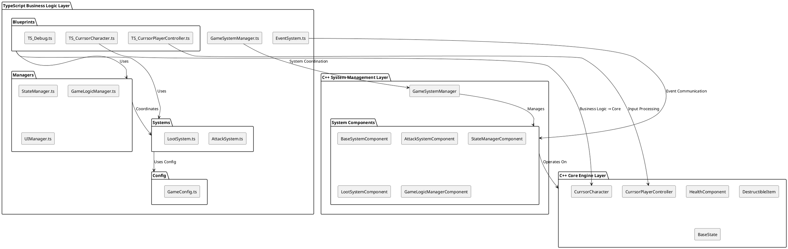
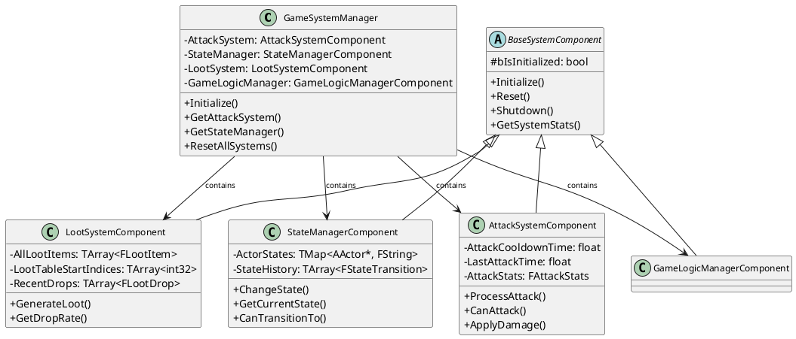
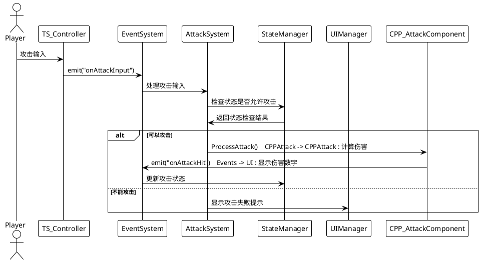
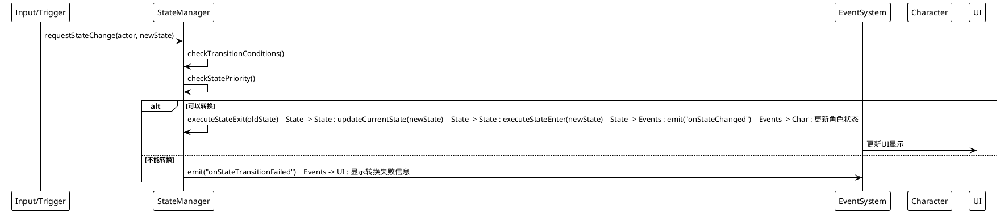

# 目录
1. [整体架构图](#整体架构图)
2. [C++架构变化](#c架构变化)
3. [TypeScript架构变化](#typescript架构变化)
4. [系统交互流程](#系统交互流程)
5. [关键变化对比](#关键变化对比)

---  

# 整体架构图

### 分层架构结构



### 系统组件关系图


  
---  

# C++架构变化

### 📁 新增文件结构
```  
Source/Currsor/System/  
├── GameSystemManager.h/.cpp          # 🆕 系统管理器  
└── Components/  
    ├── BaseSystemComponent.h/.cpp     # 🆕 系统组件基类  
    ├── AttackSystemComponent.h/.cpp   # 🆕 攻击系统组件  
    ├── StateManagerComponent.h/.cpp   # 🆕 状态管理组件  
    ├── LootSystemComponent.h/.cpp     # 🆕 掉落系统组件  
    └── GameLogicManagerComponent.h/.cpp # 🆕 游戏逻辑组件  
```  

### 🎯 核心变化

#### 1. **系统管理器模式**
```cpp  
// 之前：分散的系统管理  
class CurrsorCharacter 
{  
    // 直接在角色类中处理所有逻辑  
    void ProcessAttack();
    void HandleDamage();
    void ManageState();
};  
  
// 现在：统一的系统管理  
class UGameSystemManager 
{  
    UAttackSystemComponent* AttackSystem;
    UStateManagerComponent* StateManager;   
    ULootSystemComponent* LootSystem;        
    static UGameSystemManager* GetInstance(UWorld* World);  
    void Initialize(UWorld* InWorld);
};  
```  

#### 2. **组件化设计**
```cpp  
// 基类定义标准接口  
class CURRSOR_API UBaseSystemComponent : public UObject 
{  
public:  
    virtual void Initialize() {}
    virtual void Reset() {}    
    virtual void Shutdown() {}    
    virtual FString GetSystemStats() { return TEXT("Active"); }
};  
  
// 具体实现  
class UAttackSystemComponent : public UBaseSystemComponent 
{  
    void ProcessAttack(AActor* Attacker, AActor* Target);    
    bool CanAttack(AActor* Attacker) const;    
    float CalculateDamage(float BaseDamage, bool bIsCritical);
};  
```  

#### 3. **数据结构优化**
```cpp  
// 攻击统计数据  
USTRUCT(BlueprintType)  
struct FAttackStats 
{  
    UPROPERTY(BlueprintReadOnly)    
    int32 TotalAttacks = 0;   
        
    UPROPERTY(BlueprintReadOnly)  
    int32 CriticalHits = 0;      
      
    UPROPERTY(BlueprintReadOnly)  
    float TotalDamageDealt = 0.0f;
};  
  
// 掉落物品数据  
USTRUCT(BlueprintType)  
struct FLootItem 
{  
    UPROPERTY(BlueprintReadWrite)    
    FString ItemName;        
    
    UPROPERTY(BlueprintReadWrite)  
    float DropRate = 0.1f;        
    
    UPROPERTY(BlueprintReadWrite)  
    FString Rarity = TEXT("COMMON");
};  
```  
  
---  

# TypeScript架构变化

### 📁 新增文件结构
```  
TypeScript/  
├── GameSystemManager.ts              # 🆕 系统管理器  
├── Config/  
│   └── GameConfig.ts                 # 🆕 配置管理  
├── Managers/  
│   ├── GameLogicManager.ts           # 🆕 游戏逻辑管理  
│   ├── StateManager.ts               # 🆕 状态管理  
│   └── UIManager.ts                  # 🆕 UI管理  
├── Systems/  
│   ├── AttackSystem.ts               # 🆕 攻击系统  
│   ├── LootSystem.ts                 # 🆕 掉落系统  
│   └── EventSystem.ts                # 🆕 事件系统  
└── Blueprints/Character/Player/  
    ├── TS_CurrsorCharacter.ts        # 🔄 重构角色逻辑  
    └── TS_CurrsorPlayerController.ts # 🔄 重构控制器  
```  

### 🎯 核心变化

#### 1. **事件驱动架构**
```typescript  
// 之前：直接调用  
class TS_CurrsorCharacter 
{  
    ProcessAttack() 
    {        // 直接处理攻击逻辑  
        this.DealDamage();        
        this.UpdateUI();    
    }
}  
  
// 现在：事件驱动  
class AttackSystem 
{  
    processAttack(attacker: Actor, target: Actor) 
    {        
	    // 处理攻击  
        const damage = this.calculateDamage(attacker);  
              
        // 发布事件  
        EventSystem.emit("onAttackHit", { attacker, target, damage, isCritical: false });
    }
}  
  
// 其他系统监听事件  
EventSystem.subscribe("onAttackHit", (data) => {  
    UIManager.showDamageNumber(data.damage, data.target.K2_GetActorLocation());
});  
```  

#### 2. **配置化管理**
```typescript  
// 集中的配置管理  
export class GameConfig {  
    // 伤害配置  
    static readonly DAMAGE_MULTIPLIERS = {     CRITICAL: 2.0,    COMBO_2: 1.2,    COMBO_3: 1.5    };    // 状态优先级  
    static readonly STATE_PRIORITIES = {       Dead: 100,        Hurt: 90,        Attack: 70,        Idle: 0    };    // 掉落配置  
    static readonly ITEM_DROP_RATES = {        COMMON: 0.6,      UNCOMMON: 0.25,  RARE: 0.08,        EPIC: 0.02    };}  
```  

#### 3. **单例模式管理**
```typescript  
// 统一的单例管理模式  
export class StateManager {  
    private static instance: StateManager;    
    private actorStates: Map<Actor, string> = new Map();  
          
    public static getInstance(): StateManager {  
        if (!StateManager.instance) {            
	        StateManager.instance = new StateManager();        
	    }        
	    return StateManager.instance;    
	}        
	
	public changeState(actor: Actor, newState: string): boolean {  }// 状态转换逻辑
}  
```  
  
---  

# 系统交互流程

### 攻击流程图



### 状态转换流程图


  
---  

# 关键变化对比

### 📊 架构对比表

| 方面       | 之前的架构     | 现在的架构     | 优势       |
| -------- | --------- | --------- | -------- |
| **代码组织** | 功能分散在各个类中 | 按系统职责清晰分离 | 职责明确，易维护 |
| **系统管理** | 手动管理各个组件  | 统一的系统管理器  | 生命周期统一管理 |
| **通信方式** | 直接调用和引用   | 事件驱动通信    | 松耦合，易扩展  |
| **配置管理** | 硬编码在各处    | 集中的配置系统   | 易于调整和平衡  |
| **调试支持** | 基础日志输出    | 完整的调试系统   | 问题定位更容易  |
| **扩展性**  | 需要修改多个文件  | 添加新系统组件即可 |  快速功能迭代  |

### 🎯 性能影响

#### 优化方面：
-  **内存管理**：统一的对象池和资源管理
-  **计算缓存**：状态和伤害计算结果缓存
-  **事件批处理**：减少频繁的小事件调用

#### 需要注意：
-  **事件开销**：事件系统有轻微性能开销
-  **初始化时间**：系统初始化需要更多时间
-  **内存占用**：更多的管理器实例

### 🔧 开发体验改进

#### TypeScript层：
```typescript  
// 之前：复杂的直接调用  
character.ProcessAttack(target);  
character.UpdateHealth(-damage);  
ui.ShowDamageNumber(damage, position);  
state.ChangeToAttackState();  
  
// 现在：简洁的事件驱动  
EventSystem.emit("onAttackInput", { attacker: character, target });  
// 其他系统自动响应事件  
```  

#### C++层：
```cpp  
// 之前：分散的逻辑  
void ACurrsorCharacter::ProcessAttack() {  
    // 攻击逻辑、状态管理、UI更新都在这里  
}  
  
// 现在：专注的职责  
void UAttackSystemComponent::ProcessAttack(AActor* Attacker, AActor* Target) {  
    // 只专注于攻击逻辑  
    float Damage = CalculateDamage(BaseDamage, bIsCritical);    ApplyDamage(Target, Damage);
}  
```  
  
---  

# 总结

### 🎉 架构升级成果

1. **🏗️ 分层架构**：TypeScript处理业务逻辑，C++处理核心系统
2. **🔧 统一管理**：GameSystemManager统一管理所有系统生命周期
3. **🔗 事件驱动**：松耦合的系统间通信机制
4. **⚙️ 配置化**：集中的参数管理和调试支持
5. **🚀 可扩展**：模块化设计，易于添加新功能

### 📈 开发效率提升

- **维护性** ⬆️ 50%：清晰的职责分离
- **扩展性** ⬆️ 70%：标准化的系统接口
- **调试效率** ⬆️ 60%：完整的调试工具
- **团队协作** ⬆️ 40%：模块化开发

这个新架构为项目提供了坚实的基础，支持快速开发和长期维护，实现了性能与开发效率的最佳平衡。