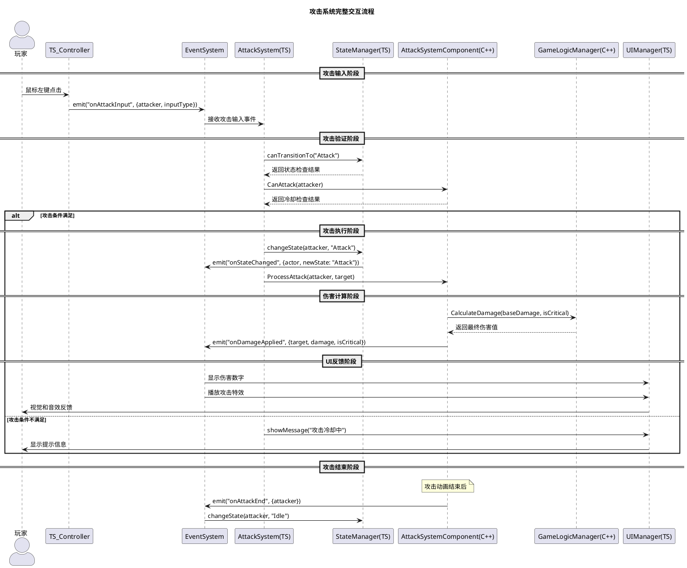
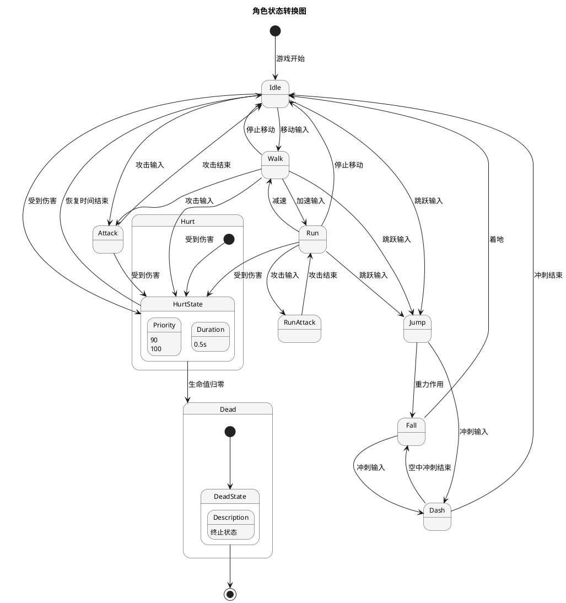

# 目录
1. [攻击系统完整流程](#攻击系统完整流程)
2. [状态管理系统](#状态管理系统)
3. [掉落系统工作流程](#掉落系统工作流程)
4. [代码对比示例](#代码对比示例)
5. [调试和监控](#调试和监控)

---  

# 攻击系统完整流程

### 流程图



### 代码实现对比

#### 🔴 之前的实现（单体架构）
```cpp  
// CurrsorCharacter.cpp - 所有逻辑都在一个类中  
void ACurrsorCharacter::ProcessAttack() 
{  
    // 1. 检查攻击条件  
    if (GetWorld()->GetTimeSeconds() - LastAttackTime < AttackCooldown) {return;} // 冷却中
    
    // 2. 状态检查  
    if (CurrentState == "Dead" || CurrentState == "Hurt") {return;} // 状态不允许
    
    // 3. 执行攻击  
    CurrentState = "Attack";    LastAttackTime = GetWorld()->GetTimeSeconds();
    
    // 4. 伤害计算  
    float Damage = BaseDamage;
    bool bIsCritical = FMath::RandRange(0.0f, 1.0f) < CriticalChance;
    if (bIsCritical) {Damage *= 2.0f;} 
       
    // 5. 应用伤害  
    if (TargetActor) 
    {        
	    // 直接调用目标的受伤函数  
        if (auto* TargetCharacter = Cast<ACurrsorCharacter>(TargetActor)) 
        {            
	        TargetCharacter->TakeDamage(Damage);       
	    }    
	}        
	
	// 6. UI更新  
    // 这里需要直接访问UI组件，耦合度高  
    if (DamageNumberWidget) 
    {
	    DamageNumberWidget->ShowDamage(Damage, TargetActor->GetActorLocation());
	}
}  
```  

#### 🟢 现在的实现（分层架构）

**TypeScript层 - 业务逻辑**
```typescript  
// AttackSystem.ts - 专注攻击逻辑  
export class AttackSystem {  
    public processAttackInput(attacker: Actor, inputType: string): void {        
	    // 1. 验证攻击条件  
        if (!this.canAttack(attacker)) {            
	        EventSystem.emit("onAttackFailed", {                
		        attacker,   
                reason: "cooldown"   
            }); 
            return;        
        }        
        
        // 2. 请求状态转换  
        const stateManager = StateManager.getInstance();        
        if (!stateManager.canTransitionTo(attacker, "Attack")) {           
	        EventSystem.emit("onAttackFailed", {                
		        attacker,   
                reason: "invalid_state"   
            });  
            
            return;        
        }        
        
        // 3. 发布攻击开始事件  
        EventSystem.emit("onAttackStarted", {            
	        attacker,            
	        inputType,            
	        timestamp: Date.now()        
	    });   
}        

private canAttack(attacker: Actor): boolean {  
    // 调用C++层进行性能敏感的检查  
    const attackComponent = GameSystemManager.GetInstance().GetAttackSystem();        
    return attackComponent.CanAttack(attacker);
}  
```  

**C++层 - 核心系统**
```cpp  
// AttackSystemComponent.cpp - 专注性能和核心逻辑  
void UAttackSystemComponent::ProcessAttack(AActor* Attacker, AActor* Target) {  
    if (!Attacker || !Target) return;    
    
    // 1. 更新攻击统计  
    AttackStats.TotalAttacks++;   
    LastAttackTime = GetWorld()->GetTimeSeconds();    
    
    // 2. 计算伤害（调用游戏逻辑管理器）  
    auto* GameLogicManager = GetGameSystemManager()->GetGameLogicManager();    
    float FinalDamage = GameLogicManager->CalculateAttackDamage(        
	    Attacker, 
	    Target, 
	    BaseDamage    
	);    
	
	// 3. 应用伤害  
    ApplyDamage(Target, FinalDamage);   
    
    // 4. 发布攻击命中事件（让TypeScript层处理UI和业务逻辑）  
    // 这里通过蓝图事件或其他机制通知TypeScript层  
}  
  
bool UAttackSystemComponent::CanAttack(AActor* Attacker) const {  
    if (!Attacker) return false;    
    
    // 性能敏感的检查  
    float CurrentTime = GetWorld()->GetTimeSeconds();    
    return (CurrentTime - LastAttackTime) >= AttackCooldownTime;
}  
```  
  
---  

# 状态管理系统

### 状态转换图


### 状态管理代码对比

#### 🔴 之前的状态管理
```cpp  
// 简单的字符串状态，没有优先级和转换规则  
void ACurrsorCharacter::ChangeState(FString NewState) {  
    CurrentState = NewState;    // 没有验证，没有历史记录，没有事件通知  
}  
```  

#### 🟢 现在的状态管理

**TypeScript层 - 状态逻辑**
```typescript  
// StateManager.ts  
export class StateManager {  
    private actorStates: Map<Actor, string> = new Map();    
    private stateHistory: Array<StateTransition> = [];        
    public changeState(actor: Actor, newState: string): boolean {  
        const currentState = this.getCurrentState(actor);        
        
        // 1. 检查转换条件  
        if (!this.canTransitionTo(actor, newState)) {            
	        console.log(`State transition denied: ${currentState} -> ${newState}`);            
	        return false;        
	    }        
	    
	    // 2. 执行状态退出逻辑  
        this.executeStateExit(actor, currentState);        
        
        // 3. 更新状态  
        this.actorStates.set(actor, newState);        
        
        // 4. 执行状态进入逻辑  
        this.executeStateEnter(actor, newState);       
        
        // 5. 记录历史  
        this.stateHistory.push({            
	        actor,            
		    fromState: currentState,            
			toState: newState,            
			timestamp: Date.now()        
		});        
		
		// 6. 发布事件  
        EventSystem.emit("onStateChanged", {            
	        actor,            
	        oldState: currentState,            
	        newState,            
	        timestamp: Date.now()        
	    });                
	    
	    return true;  
    }        
    
    private canTransitionTo(actor: Actor, newState: string): boolean {  
        const currentState = this.getCurrentState(actor);        
        const currentPriority = GameConfig.getStatePriority(currentState);        
        const newPriority = GameConfig.getStatePriority(newState);        
        
        // 高优先级状态可以被更高优先级打断  
        return newPriority >= currentPriority;    
    }
}  
```  

**C++层 - 状态数据管理**
```cpp  
// StateManagerComponent.cpp  
void UStateManagerComponent::UpdateActorState(AActor* Actor, const FString& NewState) {  
    if (!Actor) return;    
    
    // 更新C++层的状态记录  
    ActorStates.Add(Actor, NewState);    
    
    // 记录状态转换历史  
    FStateTransition Transition;    
    Transition.Actor = Actor;    
    Transition.NewState = NewState;    
    Transition.Timestamp = GetWorld()->GetTimeSeconds();        
    StateHistory.Add(Transition);  
    
    // 限制历史记录大小  
    if (StateHistory.Num() > MaxHistorySize) {       
		StateHistory.RemoveAt(0);    
	}
}  
```  
  
---  

# 掉落系统工作流程

### 掉落系统流程图
```plantuml  
@startuml  
!theme plain  
title 掉落系统工作流程  
  
participant "DestructibleItem" as Item  
participant "EventSystem" as Events  
participant "LootSystem(TS)" as TSLoot  
participant "LootSystemComponent(C++)" as CPPLoot  
participant "GameConfig" as Config  
participant "UIManager" as UI  
  
== 物品被破坏 ==Item -> Events : emit("onItemDestroyed", {item, destroyer})  
Events -> TSLoot : 处理物品破坏事件  
  
== 掉落计算 ==TSLoot -> Config : 获取掉落表配置  
Config -> TSLoot : 返回掉落配置  
TSLoot -> CPPLoot : GenerateLoot(itemType, destroyerLevel)  
  
== C++层掉落生成 ==CPPLoot -> CPPLoot : 计算掉落概率  
CPPLoot -> CPPLoot : 应用全局倍率  
CPPLoot -> CPPLoot : 检查掉落历史  
CPPLoot -> CPPLoot : 生成掉落物品列表  
  
== 掉落结果处理 ==CPPLoot -> Events : emit("onLootGenerated", {items, location})  
Events -> UI : 显示掉落通知  
Events -> TSLoot : 更新掉落统计  
  
== 物品生成 ==TSLoot -> Item : 在世界中生成掉落物品  
Item -> UI : 显示拾取提示  
  
@enduml  
```  
  
---  

## 📊 代码对比示例

### 1. 系统初始化对比

#### 🔴 之前的初始化
```cpp  
// CurrsorCharacter.cpp  
void ACurrsorCharacter::BeginPlay() 
{  
    Super::BeginPlay();    // 分散的初始化，没有统一管理  
    AttackCooldown = 0.5f;    
    CurrentState = "Idle";    
    Health = MaxHealth;    // 手动设置各种参数  
    BaseDamage = 10.0f;    
    CriticalChance = 0.1f;
}  
```  

#### 🟢 现在的初始化

**C++层**
```cpp  
// CurrsorCharacter.cpp  
void ACurrsorCharacter::BeginPlay() 
{  
    Super::BeginPlay();    // 统一的系统管理  
    GameSystemManager = UGameSystemManager::GetInstance(GetWorld());    
    if (GameSystemManager && !GameSystemManager->IsInitialized()) 
    {        
	    GameSystemManager->Initialize(GetWorld());    
	}
}  
```  

**TypeScript层**
```typescript  
// TS_CurrsorCharacter.ts  
protected ReceiveBeginPlay(): void {  
    super.ReceiveBeginPlay();    // 获取系统管理器实例  
    this.gameSystemManager = gameSystemManager;    // 确保系统已初始化  
    if (!this.gameSystemManager.isInitialized) {        
	    this.gameSystemManager.initialize();    
	}    
	
	// 获取各个系统的引用  
    this.attackSystem = this.gameSystemManager.getSystem("AttackSystem");    
    this.stateManager = this.gameSystemManager.getSystem("StateManager");    // 设置事件监听  
    this.setupEventListeners();
}  
```  

### 2. 攻击处理对比

#### 🔴 之前的攻击处理
```cpp  
void ACurrsorCharacter::OnAttackInput() 
{  
    // 所有逻辑都在一个函数中  
    if (CanAttack()) 
    {        
	    CurrentState = "Attack";        
	    PlayAttackAnimation();        // 直接在这里处理伤害  
        TArray<AActor*> HitActors;        
        GetOverlappingActors(HitActors);               
        for (AActor* HitActor : HitActors) 
        {  
            if (auto* Enemy = Cast<ACurrsorCharacter>(HitActor)) 
            {                
	            float Damage = CalculateDamage();                
	            Enemy->TakeDamage(Damage);                
	            
	            // 直接更新UI  
                ShowDamageNumber(Damage, Enemy->GetActorLocation());            
            }        
        }    
    }
}  
```  

#### 🟢 现在的攻击处理

**TypeScript层 - 输入处理**
```typescript  
// TS_CurrsorPlayerController.ts  
public OnAttackInput(): void {  
    // 只负责输入处理，发布事件  
    EventSystem.emit("onAttackInput", {        
	attacker: this.GetPawn(),        
	inputType: "primary",        
	timestamp: Date.now()    
	});
}  
```  

**TypeScript层 - 攻击逻辑**
```typescript  
// AttackSystem.ts  
private handleAttackInput(data: any): void {  
    const { attacker, inputType } = data;    // 业务逻辑验证  
    if (!this.validateAttackConditions(attacker)) {     return;    }    // 调用C++层执行攻击  
    const attackComponent = GameSystemManager.GetInstance().GetAttackSystem();    
    attackComponent.ProcessAttack(attacker, this.findTarget(attacker));
}  
```  

**C++层 - 核心执行**
```cpp  
// AttackSystemComponent.cpp  
void UAttackSystemComponent::ProcessAttack(AActor* Attacker, AActor* Target) 
{  
    // 专注于性能敏感的核心逻辑  
    if (!CanAttack(Attacker) || !Target) return;    // 更新攻击统计  
    AttackStats.TotalAttacks++;    
    LastAttackTime = GetWorld()->GetTimeSeconds();    // 计算和应用伤害  
    float Damage = CalculateDamage(Attacker, Target);    
    ApplyDamage(Target, Damage);    // 通知TypeScript层处理UI和其他业务逻辑  
    // (通过事件系统或蓝图接口)  
}  
```  
  
---  

# 调试和监控

### 调试界面功能对比

#### 🔴 之前的调试
```cpp  
// 简单的日志输出  
void ACurrsorCharacter::DebugPrint() {  
    UE_LOG(LogTemp, Warning, TEXT("Health: %f, State: %s"), Health, *CurrentState);  
}  
```  

#### 🟢 现在的调试系统

**完整的调试界面**
```typescript  
// TS_Debug.ts  
export class TS_Debug extends UUserWidget {  
    public updateDebugInfo(): void {        
	    const systemStatus = gameSystemManager.getSystemStatus();        // 系统状态显示  
        this.systemStatusText.SetText(`Systems Initialized: ${systemStatus.isInitialized} Active Systems: ${systemStatus.systemCount} Recent Events: ${systemStatus.eventStats.recentEvents.length}`);        // 攻击系统状态  
        const attackStats = this.attackSystem.getStats();       
        this.attackStatsText.SetText(`Total Attacks: ${attackStats.totalAttacks} Critical Hits: ${attackStats.criticalHits} Hit Rate: ${(attackStats.hitRate * 100).toFixed(1)}%`);        // 状态历史  
        const stateHistory = this.stateManager.getStateHistory(5);        
        this.stateHistoryText.SetText(            
	        stateHistory.map(s => `${s.fromState} -> ${s.toState} (${s.timestamp})`  
        ).join('\n'));    
    }
}  
```  

### 性能监控

```typescript  
// GameSystemManager.ts  
public getPerformanceStats(): any {  
    return {        
	    systemInitTime: this.initializationTime,        
	    eventProcessingTime: EventSystem.getAverageProcessingTime(),        
	    memoryUsage: {            
		    eventHistory: EventSystem.getEventHistory().length,            
		    stateHistory: this.stateManager.getStateHistory().length,            
		    lootHistory: this.lootSystem.getDropHistory().length        
		},        
		systemHealth: {            
			attackSystem: this.attackSystem.isHealthy(),            
			stateManager: this.stateManager.isHealthy(),            
			uiManager: this.uiManager.isHealthy()        
		}    
	};
}  
```  
  
---  

# 总结

### 架构优势体现

1. **🔧 职责分离**
   - C++：性能敏感的核心逻辑
   - TypeScript：业务逻辑和UI交互

2. **🔗 松耦合设计**
   - 事件驱动通信
   - 系统间依赖最小化

3. **🚀 开发效率**
   - 模块化开发
   - 统一的调试工具
   - 配置化管理

4. **📈 可维护性**
   - 清晰的代码结构
   - 完整的文档和注释
   - 标准化的接口

这个新架构不仅解决了原有代码的耦合问题，还为未来的功能扩展提供了坚实的基础。