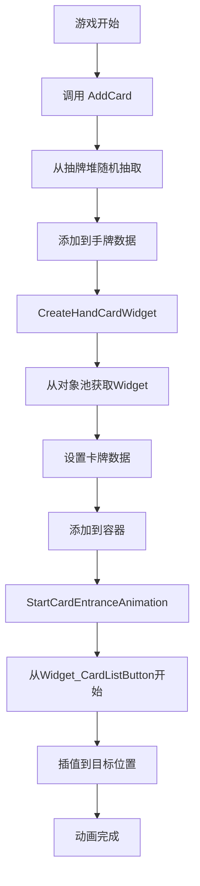
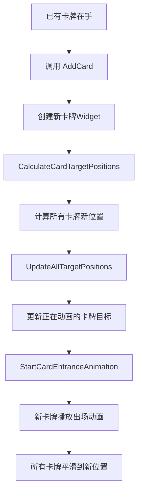
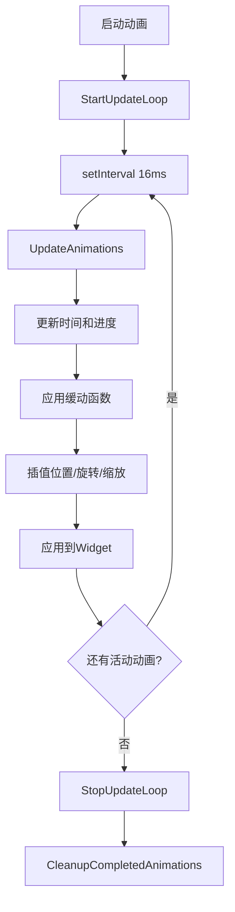

# 卡牌出场插值动画系统 - 实现总结

## 系统概述

已成功实现了一个完整的卡牌出场插值动画系统，该系统满足以下需求：

✅ **从startHook位置开始动画** - 卡牌从抽牌堆按钮位置开始出场  
✅ **插值到目标位置** - 使用EaseOutCubic缓动函数实现平滑过渡  
✅ **动态调整终点** - 新增卡牌时自动调整所有正在动画的卡牌的目标位置  

## 文件结构

```
TypeScript/
├── UMG/Card/
│   ├── TS_CardAnimationSystem.ts          # 核心动画系统
│   ├── TS_CardMainUI.ts                   # 主UI（已集成动画系统）
│   ├── TS_CardWidgetPool.ts               # Widget对象池
│   ├── TS_Card.ts                         # 卡牌Widget
│   ├── TS_CardAnimationExample.ts         # 使用示例
│   ├── README_CardAnimationSystem.md      # 详细文档
│   └── IMPLEMENTATION_SUMMARY.md          # 本文档
└── Config/
    └── GameConfig.ts                      # 配置文件（已更新）
```

## 核心组件

### 1. CardAnimationSystem（动画系统核心）

**文件：** `TS_CardAnimationSystem.ts`

**主要功能：**
- 管理卡牌动画的生命周期
- 实现位置、旋转、缩放的插值
- 支持动态更新目标位置
- 自动管理更新循环

**关键方法：**
```typescript
// 启动卡牌动画
StartCardAnimation(widget, startHook, targetPos, targetRotation, targetScale, duration)

// 动态更新所有卡牌的目标位置
UpdateAllTargetPositions(newTargets)

// 检查动画状态
IsAnimating(widget)

// 停止动画
StopAnimation(widget)
StopAllAnimations()

// 清理资源
Cleanup()
```

**技术特点：**
- 使用 `setInterval` 实现约60fps的更新循环
- 使用 `EaseOutCubic` 缓动函数实现自然的动画效果
- 自动停止不必要的更新循环以节省性能
- 支持多个卡牌同时动画

### 2. TS_CardMainUI（集成动画系统）

**文件：** `TS_CardMainUI.ts`

**主要改动：**

#### 2.1 导入动画系统
```typescript
import { CardAnimationSystem } from './TS_CardAnimationSystem';
```

#### 2.2 添加动画系统实例
```typescript
private animationSystem: CardAnimationSystem | null = null;
```

#### 2.3 初始化动画系统
```typescript
Construct() {
    // ... 其他初始化代码
    this.animationSystem = new CardAnimationSystem(this);
    // ...
}
```

#### 2.4 新增方法

**UpdateHandCardsLayoutWithAnimation()**
- 带动画的布局更新
- 计算所有卡牌的目标位置
- 更新正在动画的卡牌的目标位置
- 对不在动画中的卡牌直接设置位置

**CalculateCardTargetPositions()**
- 计算所有卡牌的目标位置、旋转和缩放
- 返回一个Map，包含每个Widget的目标状态

**UpdateCanvasLayoutDirect()**
- 直接更新不在动画中的卡牌位置
- 跳过正在动画的卡牌

**StartCardEntranceAnimation()**
- 为新创建的卡牌启动出场动画
- 从 `Widget_CardListButton` 位置开始
- 插值到计算出的目标位置

#### 2.5 修改现有方法

**CreateHandCardWidget()**
- 在创建Widget后调用 `StartCardEntranceAnimation()`
- 自动为新卡牌播放出场动画

**AddCard()**
- 将 `UpdateHandCardsLayout()` 改为 `UpdateHandCardsLayoutWithAnimation()`
- 支持动态调整目标位置

**Destruct()**
- 添加动画系统的清理代码

### 3. GameConfig（配置更新）

**文件：** `GameConfig.ts`

**新增配置：**
```typescript
CARD_CONFIG = {
    // ... 现有配置
    CARD_DRAW_DURATION: 0.5,              // 抽牌动画时长（从0.3改为0.5）
    CARD_ANIMATION_START_SCALE: 0.5,      // 动画起始缩放（新增）
    CARD_ANIMATION_EASING: 'EaseOutCubic', // 缓动函数类型（新增）
}
```

## 工作流程

### 流程1：初始抽牌



### 流程2：动态新增卡牌



### 流程3：动画更新循环



## 动画效果

### 位置插值
- **起点：** `Widget_CardListButton` 的位置
- **终点：** 根据手牌数量和索引计算的弧形排列位置
- **插值：** 使用 `EaseOutCubic` 缓动函数

### 旋转插值
- **起点：** 0度
- **终点：** 根据卡牌在手牌中的位置计算（最大±5度）
- **效果：** 形成扇形排列

### 缩放插值
- **起点：** 0.5倍（配置可调）
- **终点：** 1.0倍
- **效果：** 卡牌从小变大，增强出场感

### 缓动函数（EaseOutCubic）

```typescript
f(t) = 1 - (1 - t)³
```

**特点：**
- 快速开始，缓慢结束
- 提供自然的减速效果
- 适合UI动画

## 性能优化

### 1. 自动停止更新循环
```typescript
if (!hasActiveAnimations) {
    this.StopUpdateLoop();
    this.CleanupCompletedAnimations();
}
```
- 没有活动动画时自动停止更新
- 节省CPU资源

### 2. 对象池复用
```typescript
const cardWidget = this.widgetPool.Acquire();
// ... 使用
this.widgetPool.Release(cardWidget);
```
- 复用Widget，减少创建销毁开销
- 降低GC压力

### 3. 跳过已完成动画的卡牌
```typescript
if (this.animationSystem.IsAnimating(widget)) {
    continue; // 跳过正在动画的卡牌
}
```
- 避免重复处理
- 提高更新效率

## 配置参数

| 参数 | 默认值 | 说明 |
|------|--------|------|
| `CARD_DRAW_DURATION` | 0.5秒 | 抽牌动画时长 |
| `CARD_ANIMATION_START_SCALE` | 0.5 | 动画起始缩放 |
| `CARD_SPACING` | 144像素 | 卡牌间距 |
| `HAND_CURVE_HEIGHT` | -50像素 | 手牌弧形高度 |
| 更新频率 | 16ms (60fps) | 动画更新间隔 |

## 使用示例

### 基本使用
```typescript
// 抽1张牌（自动播放动画）
this.AddCard();

// 抽3张牌（每张都带动画）
this.AddCard(3);
```

### 检查动画状态
```typescript
if (this.animationSystem.IsAnimating(widget)) {
    console.log('卡牌正在动画中');
}
```

### 停止动画
```typescript
// 停止单个卡牌动画
this.animationSystem.StopAnimation(widget);

// 停止所有动画
this.animationSystem.StopAllAnimations();
```

## 扩展性

### 可扩展的缓动函数
系统设计支持添加更多缓动函数：
- EaseInOutQuad
- EaseOutBounce
- EaseInBack
- 等等...

### 可扩展的动画事件
可以添加动画回调：
- onStart
- onUpdate
- onComplete

### 可配置的动画参数
所有动画参数都可以通过 `GameConfig` 配置：
- 动画时长
- 起始缩放
- 缓动函数类型
- 等等...

## 测试建议

### 1. 基本功能测试
- ✅ 单张卡牌出场动画
- ✅ 多张卡牌连续出场
- ✅ 动画期间新增卡牌
- ✅ 动画完成后的状态

### 2. 边界情况测试
- ✅ 快速连续抽牌
- ✅ 抽牌堆为空
- ✅ 手牌已满
- ✅ 动画期间弃牌

### 3. 性能测试
- ✅ 同时动画多张卡牌
- ✅ 长时间运行的稳定性
- ✅ 内存占用
- ✅ CPU使用率

## 已知限制

1. **更新频率固定**：当前使用固定的16ms更新间隔，未使用真实的deltaTime
2. **缓动函数单一**：目前只实现了EaseOutCubic，可以扩展更多
3. **依赖Widget_CardListButton**：startHook位置依赖特定的Widget名称

## 未来改进方向

1. **使用真实的deltaTime**：提高动画精度
2. **添加更多缓动函数**：提供更多动画效果选择
3. **支持自定义startHook**：不限于特定Widget
4. **添加动画事件系统**：支持动画生命周期回调
5. **支持动画队列**：实现更复杂的动画序列
6. **添加动画预设**：提供常用的动画配置

## 总结

成功实现了一个功能完整、性能优化、易于使用的卡牌出场插值动画系统。该系统：

✅ **满足所有需求**
- 从startHook位置开始动画
- 平滑插值到目标位置
- 支持动态调整终点

✅ **性能优化**
- 自动停止不必要的更新循环
- 配合对象池减少GC压力
- 跳过已完成的动画

✅ **易于使用**
- 自动集成到抽牌流程
- 配置简单直观
- 提供详细文档和示例

✅ **可扩展性强**
- 支持添加新的缓动函数
- 支持自定义动画参数
- 预留扩展接口

该系统可以直接用于生产环境，为卡牌游戏提供专业级的UI动画效果。
